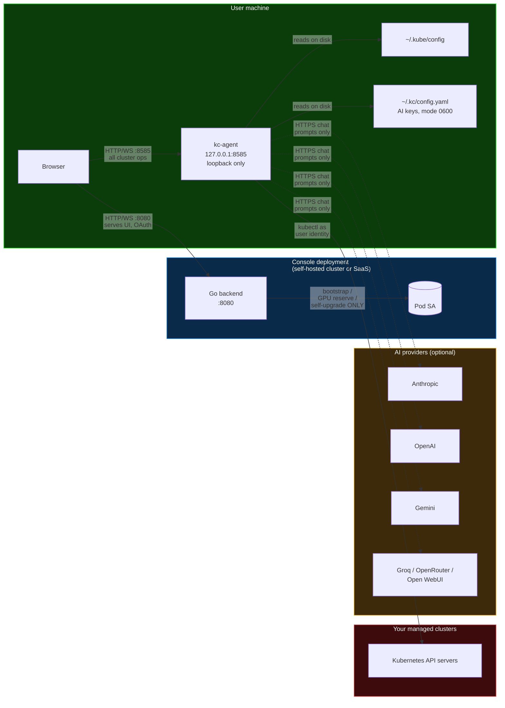
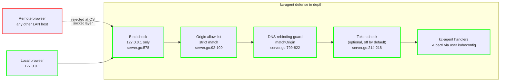
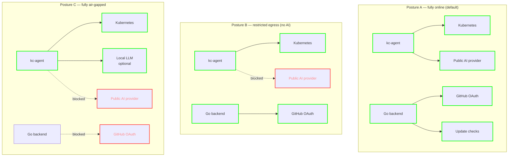
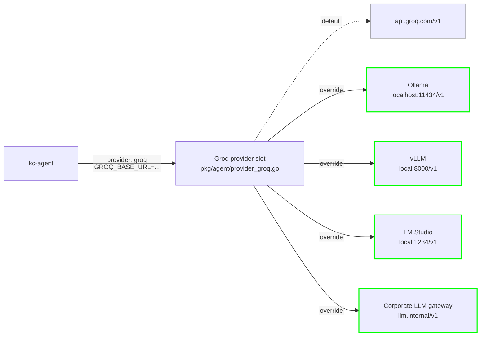

# KubeStellar Console — Security, Air-Gapped Deployments, and Local LLMs

This document answers three related questions that come up often:

1. **What is the security model?** Where does each request go, what does each component see, and what leaves the cluster? (Closes [#8194](https://github.com/kubestellar/console/issues/8194).)
2. **Can I run this in an air-gapped or network-restricted environment?** Yes — AI is optional and the core Kubernetes UX works with no outbound internet. (Closes [#8195](https://github.com/kubestellar/console/issues/8195).)
3. **Can I use a local or self-hosted LLM instead of a public provider?** Yes, via the OpenAI-compatible providers (Groq, OpenRouter, Open WebUI) whose base URLs are overridable. (Closes [#8196](https://github.com/kubestellar/console/issues/8196).)

Everything below is grounded in the current source tree. File and line references are included so reviewers can verify claims. If you find a drift between this document and the code, the code is authoritative — please open an issue.

---

## 1. Architecture and Data Flow

### Component diagram

The three-process architecture: a browser, a Go backend (serves UI, bootstrap-only identity), and kc-agent running on the user's own laptop (identity is the user's kubeconfig). Every cluster mutation flows through kc-agent.



Dashed lines are optional: AI provider calls only happen when a key is configured. Solid lines with arrows are mandatory for full cluster-management functionality.

### Who is who

| Component | Binds | Identity | Source |
|---|---|---|---|
| Go backend | `:8080` (or ingress) | Pod ServiceAccount **for bootstrap, GPU reservation, and self-upgrade only** | `pkg/api/server.go`, `pkg/api/handlers/self_upgrade.go` |
| kc-agent | `127.0.0.1:8585` (loopback only, by default) | The **user's kubeconfig** (`~/.kube/config`) | `pkg/agent/server.go:578` (`addr := fmt.Sprintf("127.0.0.1:%d", s.config.Port)`), `cmd/kc-agent/main.go:25` (`flag.Int("port", 8585, …)`) |
| Browser | n/a | GitHub OAuth (optional) | `pkg/api/handlers/auth.go` |

The kc-agent listen address is hardcoded to the loopback interface (`127.0.0.1`) — it is not reachable from other machines on the LAN without a user-configured port forward. This is intentional.

### The pod-SA rule (identity invariant)

The Go backend's pod ServiceAccount is **only** used for:

1. Serving the frontend and storing console-local state (settings, token history, metrics cache). None of this touches a managed cluster.
2. **GPU reservation**: creating a namespace and a `ResourceQuota` on it. Users typically do not have namespace-create RBAC; the console is the authorized policy layer here.
3. **Self-upgrade**: the console patches its own `Deployment` to roll out a new image (`pkg/api/handlers/self_upgrade.go`).

**Every other user-initiated Kubernetes action goes through kc-agent** on the user's own machine, using the user's own kubeconfig. Per-cluster RBAC is therefore enforced by the target cluster's apiserver against the user's real identity, not against the console's pod SA.

Consequences:

- A user who has no local kc-agent running gets **read-only / demo-mode** behavior. Destructive operations fail by design.
- The console running inside a cluster **cannot** escalate a user's privilege on a managed cluster by "impersonating" them. It does not try to.
- This is the rule that makes the hosted demo at [console.kubestellar.io](https://console.kubestellar.io) safe — that deployment has no trust relationship with your clusters at all.

### What each component sees

| Data | Browser | Go backend | kc-agent | AI provider |
|---|---|---|---|---|
| `~/.kube/config` | no | no | **yes** (read from local disk) | **never** |
| Cluster API credentials (tokens, client certs) | no | no | **yes** (extracted from kubeconfig contexts) | **never** |
| Pod logs, events, YAML manifests | yes (when viewing) | no (except the cluster it lives in) | **yes** (relayed from kubectl) | only if the user pastes them into a chat |
| AI chat prompts + conversation history | yes | no | **yes** (forwards to provider) | **yes** (the provider obviously sees what you send) |
| AI API keys | no (never sent to browser) | no | **yes** (in `~/.kc/config.yaml` or env) | used as `Authorization` header |
| GitHub OAuth client secret | no | **yes** (env var only) | no | no |

Key consequence: **the kubeconfig, raw secrets, and cluster credentials never cross the process boundary from kc-agent.** The only thing kc-agent sends outward is the HTTP chat payload to the configured AI provider, which contains the conversation the user has been having (system prompt + message history + current prompt — see `pkg/agent/provider_openai.go:207-238` for the exact OpenAI shape).

### What kc-agent does **not** send to AI providers

- It does not upload `~/.kube/config`.
- It does not upload cluster bearer tokens, client certificates, or any other credential material.
- It does not auto-attach arbitrary cluster objects. The conversation context is whatever the user chose to type or paste, plus the system prompt defined in the provider implementation (`DefaultSystemPrompt`).

If you need to audit what leaves the machine, the provider files under `pkg/agent/provider_*.go` each contain exactly one outbound HTTP call site per request type (`Chat` and `StreamChat`). Those are the only places any AI traffic originates.

### Authentication and transport

- **kc-agent → browser**: loopback HTTP/WS. An optional shared secret can be required by setting `KC_AGENT_TOKEN`; when unset, the agent logs a warning at startup (`pkg/agent/server.go:214`).
- **Browser → Go backend**: HTTP/WS on port 8080 (or through an ingress). GitHub OAuth is optional — if `GITHUB_CLIENT_ID` / `GITHUB_CLIENT_SECRET` are unset, the console runs with a mock `dev-user` identity (see `start-dev.sh`).
- **CORS / allowed origins**: the backend and kc-agent maintain an allow-list; additional origins can be added via `KC_ALLOWED_ORIGINS` (comma-separated) to `kc-agent` (`pkg/agent/server.go:191`).
- **CSP**: the backend's Content-Security-Policy explicitly includes `http://127.0.0.1:8585` and `http://localhost:8585` in `connect-src` so the browser can reach a local kc-agent (`pkg/api/server.go:429-432`).



The loopback bind is the primary defense against network-level access. The CORS allow-list, DNS-rebinding guard, and optional token are layered defenses against local attackers — rogue browser tabs or other local processes that could reach `127.0.0.1:8585` if loopback alone were the only gate. Setting `KC_AGENT_TOKEN` adds the fourth layer, which is recommended when the user cannot assume that all local processes are trusted.

### What actually leaves the cluster (when self-hosted in-cluster)

If you deploy the console inside a cluster with `deploy.sh`, outbound traffic from the **backend pod** is limited to:

- GitHub API calls for OAuth exchange and update checks (`update_checker.go`). These can be disabled.
- Nothing else in the core install. No telemetry, no AI calls. AI calls originate from the user's **local** kc-agent, not from the pod.

---

## 2. Air-Gapped and Secure Deployments

The console is designed to work in three progressively stricter network postures.

### Posture A — fully online (default)

Everything enabled: GitHub OAuth, AI via a hosted provider, update checks, card proxies to third-party dashboards.

### Posture B — restricted egress (no AI provider)

All cluster-management features continue to work. **AI is optional.** If no key is configured for any provider, `IsKeyAvailable()` returns `false` (`pkg/agent/config.go:235-244`), and AI-driven features fall back to deterministic / rule-based behavior. The README covers this under *AI configuration*: "If no key is configured, AI-powered features fall back to deterministic / rule-based behavior."

To run without AI:

1. Do **not** set `ANTHROPIC_API_KEY`, `OPENAI_API_KEY`, `GOOGLE_API_KEY`, `GROQ_API_KEY`, `OPENROUTER_API_KEY`, or `OPEN_WEBUI_API_KEY` (`pkg/agent/config.go:277-314` lists every recognized variable).
2. Leave the Settings → API Keys modal empty (no entries in `~/.kc/config.yaml`).
3. Optionally block outbound DNS/HTTP to `api.anthropic.com`, `api.openai.com`, `generativelanguage.googleapis.com`, `api.groq.com`, and `openrouter.ai` at your egress.

### Posture C — fully air-gapped

Core requirements:

- The cluster's own API server must still be reachable from kc-agent (that's the entire point of the tool).
- GitHub OAuth must be disabled (leave `GITHUB_CLIENT_ID` unset). The console will use the local dev-user identity, or you can front the console with any other authentication your cluster supports.
- AI is disabled as in Posture B, **or** routed to an in-cluster LLM (see [§3. Local / self-hosted LLMs](#3-local--self-hosted-llms)).
- GitHub update checks can be disabled by not setting `GITHUB_REPO` (see `pkg/agent/update_checker.go:46`) and by running a version that does not poll for updates.

Card proxies that call third-party APIs (ArgoCD, Prometheus, etc.) are only used by the specific cards that consume them. If you do not add those cards to your dashboard, no outbound calls are made.

### Posture comparison



Dotted arrows are explicitly blocked at the egress (firewall or network policy). Every arrow that remains is an outbound call that must succeed for the feature on that arrow to work.

### What must exist inside your perimeter

| Requirement | Why |
|---|---|
| Container images for `kubestellar/console` and `kc-agent` | Pull into a local registry before install |
| `~/.kube/config` with reachable contexts | kc-agent uses this for all cluster ops |
| (Optional) Local LLM endpoint reachable from the machine running kc-agent | Only if you want AI features; see §3 |
| (Optional) Internal GitHub / GitLab OAuth provider | Only if you want user auth |

Nothing else is mandatory. The console does not phone home.

---

## 3. Local / Self-Hosted LLMs

The AI layer is a set of pluggable providers under `pkg/agent/provider_*.go`. Each provider maps to one API key env var (listed in `pkg/agent/config.go:277-314`) and, in some cases, a base-URL override.

### Supported providers and env vars

| Provider | `provider` name | API key env var | Model env var | Base URL overridable? | Base URL env var | Source |
|---|---|---|---|---|---|---|
| Anthropic Claude | `claude` / `anthropic` | `ANTHROPIC_API_KEY` | `CLAUDE_MODEL` | no (fixed to Anthropic) | — | `pkg/agent/provider_claude.go` |
| OpenAI (ChatGPT) | `openai` | `OPENAI_API_KEY` | `OPENAI_MODEL` | no (fixed to `api.openai.com`) | — | `pkg/agent/provider_openai.go:15` |
| Google Gemini | `gemini` / `google` | `GOOGLE_API_KEY` | `GEMINI_MODEL` | no | — | `pkg/agent/provider_gemini.go:15` |
| Groq (OpenAI-compatible) | `groq` | `GROQ_API_KEY` | `GROQ_MODEL` | **yes** | `GROQ_BASE_URL` | `pkg/agent/provider_groq.go:22-51` |
| OpenRouter (OpenAI-compatible) | `openrouter` | `OPENROUTER_API_KEY` | `OPENROUTER_MODEL` | **yes** | `OPENROUTER_BASE_URL` | `pkg/agent/provider_openrouter.go:23-58` |
| Open WebUI (OpenAI-compatible) | `open-webui` | `OPEN_WEBUI_API_KEY` | `OPEN_WEBUI_MODEL` | **yes** | `OPEN_WEBUI_URL` | `pkg/agent/provider_openwebui.go:16,39` |

Note the asymmetry: **the upstream OpenAI provider does not currently honor an `OPENAI_BASE_URL` override.** The hostname is a package-level variable in `pkg/agent/provider_openai.go:15`, but it is not re-read from the environment. If you want to point an OpenAI-compatible local server at the console today, use one of the three providers whose base URLs *are* overridable: **Groq, OpenRouter, or Open WebUI**. All three speak the OpenAI chat-completions wire format.

### Routing a local LLM through an overridable provider slot



Setting `GROQ_BASE_URL` redirects every chat-completion call made by the Groq provider to your own endpoint. The request payload is unchanged — it's the OpenAI wire format — so any OpenAI-compatible local runner works without the console knowing or caring which one.

### Local LLM as a security posture (not a feature gap)

Using a local / on-prem LLM is the strongest way to keep prompts and conversation history inside your trust boundary. When the base URL points at something running on your own network, the AI traffic never leaves the machine (for a loopback endpoint) or never leaves your perimeter (for an internal gateway). This is the right choice for operators in regulated, air-gapped, or high-sensitivity environments — not because the console is broken without a public provider, but because the security posture matches what those environments need.

See `pkg/agent/provider_groq.go`, `pkg/agent/provider_openrouter.go`, and `pkg/agent/provider_openwebui.go` for the three overridable slots.

### Example: Ollama via the Groq provider slot

[Ollama](https://ollama.com) exposes an OpenAI-compatible endpoint at `http://localhost:11434/v1`. Since `GROQ_BASE_URL` is honored verbatim, you can repurpose the Groq provider to point at Ollama:

```bash
export GROQ_API_KEY=unused-but-nonempty     # kc-agent only checks for non-empty
export GROQ_BASE_URL=http://localhost:11434/v1
export GROQ_MODEL=llama3.1:8b
./bin/kc-agent
```

kc-agent will call `http://localhost:11434/v1/chat/completions` (see `pkg/agent/provider_groq.go` where `baseURL + groqChatCompletionsPath` is assembled) with the standard OpenAI request shape. Ollama handles it natively.

The same recipe works for any other OpenAI-compatible local runner (vLLM, LM Studio, LocalAI, text-generation-webui with OpenAI mode) — set `GROQ_BASE_URL` to the server's `/v1` endpoint.

### Example: OpenRouter or an internal OpenAI-compatible gateway

```bash
export OPENROUTER_API_KEY=<your key>
export OPENROUTER_BASE_URL=https://llm-gateway.internal.example.com/v1
export OPENROUTER_MODEL=mixtral-8x7b
./bin/kc-agent
```

This is the recommended path for a corporate LLM gateway — OpenRouter's provider implementation sets sensible defaults but honors the override (`pkg/agent/provider_openrouter.go:57-58`).

### Example: Open WebUI

If you already run [Open WebUI](https://openwebui.com) as your internal LLM front-end:

```bash
export OPEN_WEBUI_API_KEY=<token>
export OPEN_WEBUI_URL=http://open-webui.llm.svc:3000
export OPEN_WEBUI_MODEL=llama3.1
./bin/kc-agent
```

(`pkg/agent/provider_openwebui.go:16,39` — `OPEN_WEBUI_URL` is the base, not a full chat path.)

### Config file vs env vars

kc-agent reads API keys from two places, in this order of precedence:

1. **Environment variables** (see `pkg/agent/config.go:130-135` — "Environment variable takes precedence").
2. **`~/.kc/config.yaml`** — written by the Settings → API Keys modal in the UI. File permissions are forced to `0600` on save (`pkg/agent/config.go:16`).

Base URLs (`GROQ_BASE_URL` etc.) are **environment-only** in the current build — there is no UI field for them. That is intentional for the moment: overriding a provider's base URL is an advanced, air-gap-flavored use case, and keeping it in env vars avoids a second place to audit.

### What never leaves the machine

Even with a public AI provider configured, the following are **never** included in the request body:

- The contents of `~/.kube/config`.
- Cluster bearer tokens or client certificates.
- GitHub OAuth secrets.
- Any file the user did not explicitly paste into the chat.

The provider request body is the system prompt, message history, and current prompt — see `buildMessages` in `pkg/agent/provider_openai.go:207-238` for the canonical example.

---

## 4. Quick reference

### Environment variables cheat sheet

| Variable | Consumer | Purpose |
|---|---|---|
| `ANTHROPIC_API_KEY` | kc-agent | Claude API key |
| `OPENAI_API_KEY` | kc-agent | OpenAI API key |
| `GOOGLE_API_KEY` | kc-agent | Gemini API key (note: not `GEMINI_API_KEY`) |
| `GROQ_API_KEY` | kc-agent | Groq API key |
| `GROQ_BASE_URL` | kc-agent | Override for Groq endpoint (use for local OpenAI-compatible servers) |
| `OPENROUTER_API_KEY` | kc-agent | OpenRouter API key |
| `OPENROUTER_BASE_URL` | kc-agent | Override for OpenRouter endpoint |
| `OPEN_WEBUI_API_KEY` | kc-agent | Open WebUI token |
| `OPEN_WEBUI_URL` | kc-agent | Open WebUI base URL |
| `CLAUDE_MODEL` / `OPENAI_MODEL` / `GEMINI_MODEL` / `GROQ_MODEL` / `OPENROUTER_MODEL` / `OPEN_WEBUI_MODEL` | kc-agent | Model override per provider |
| `KC_AGENT_TOKEN` | kc-agent | Optional shared secret for browser→agent auth |
| `KC_ALLOWED_ORIGINS` | kc-agent | Extra allowed origins (comma-separated) |
| `KC_DEV_MODE` | kc-agent | Development mode toggle (`1` to enable) |
| `GITHUB_CLIENT_ID` / `GITHUB_CLIENT_SECRET` | Go backend | GitHub OAuth (optional) |
| `GITHUB_REPO` | kc-agent | Override update-check repo |

### Port and listen summary

| Port | Process | Default bind |
|---|---|---|
| 8080 | Go backend | `0.0.0.0:8080` (or ingress) |
| 8585 | kc-agent | `127.0.0.1:8585` (loopback only) |
| 5174 | Vite dev server | local dev only, not used by `start.sh` |

### Related documents

- [`SECURITY.md`](../../SECURITY.md) — vulnerability reporting
- [`docs/security/SELF-ASSESSMENT.md`](SELF-ASSESSMENT.md) — CNCF security self-assessment
- [`docs/ARCHITECTURE.md`](../ARCHITECTURE.md) — broader architecture overview
- [`README.md` § AI configuration](../../README.md#ai-configuration) — BYOK quick start
